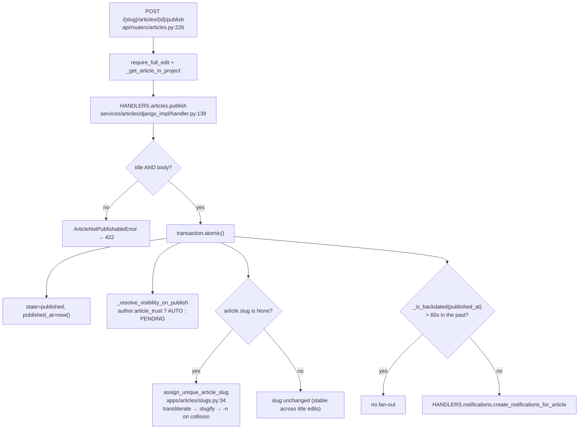
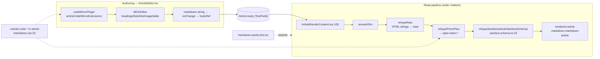
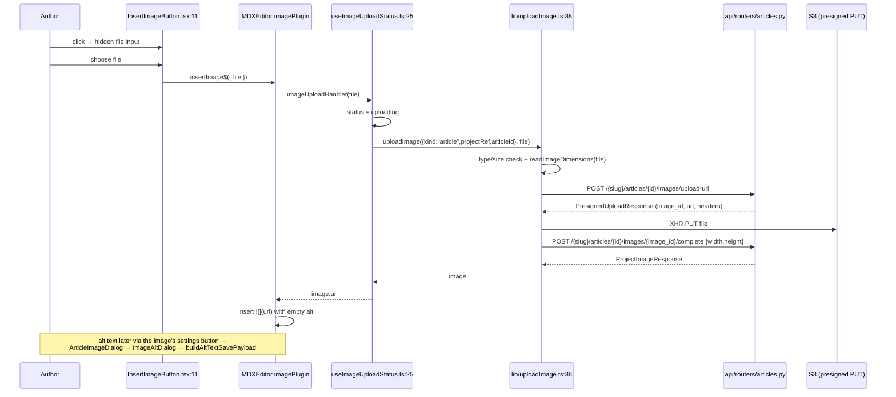
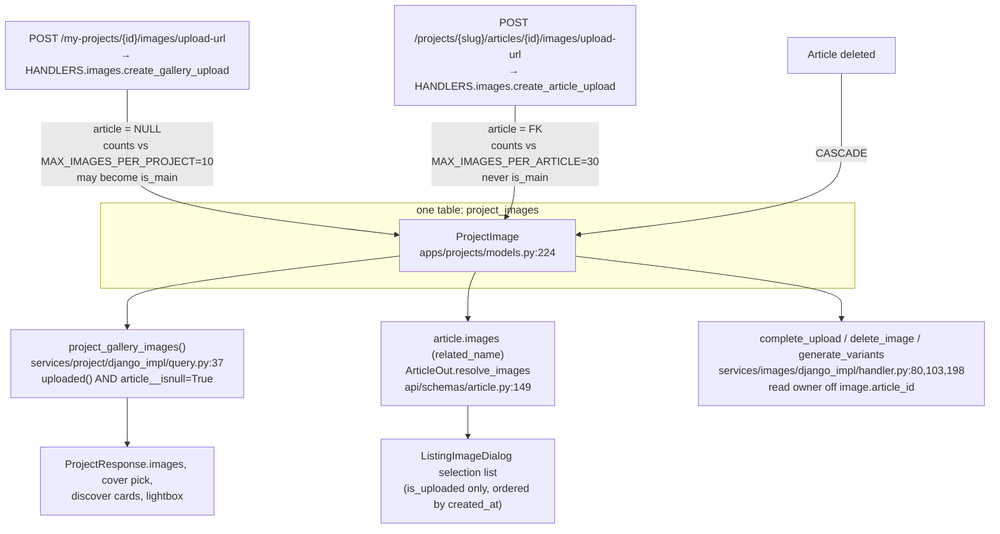
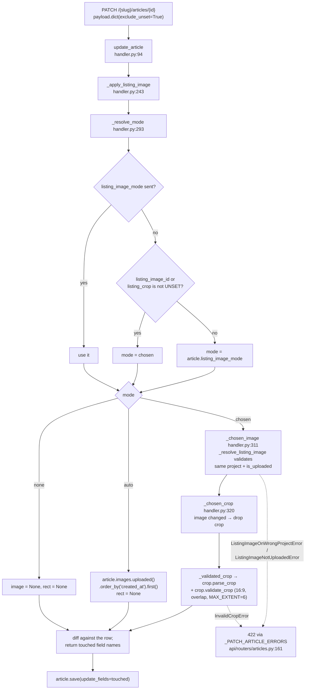
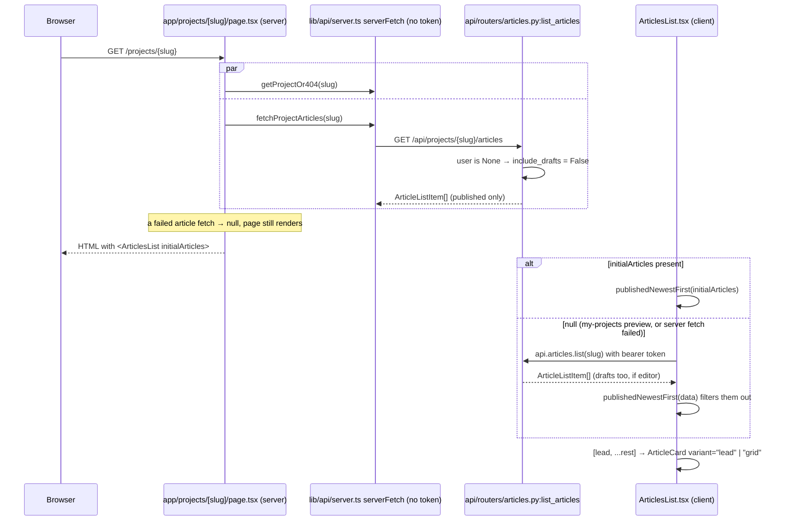
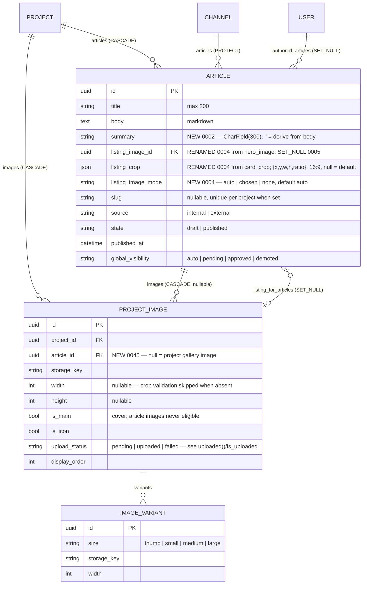

# Articles — feature map

Scope: everything article-shaped in `git diff d2463b33a7063bd4dae20b8add728aaf5046b8b2...7a20fb38`.
Paths are relative to the repo root. Line numbers are from the tree at `7a20fb38`.

## What shipped

The branch turns the article model that already existed (`apps/articles`, added on
`main` in `0001_initial`) into a usable authoring product: an editor route under
`/projects/[slug]/articles/{new,edit/[articleId]}`, a public render route at
`/projects/[slug]/articles/[articleSlug]`, an articles tab on both the public
project page and the my-projects editor, and a REST surface on
`api/routers/articles.py` covering CRUD, publish and article-scoped image uploads.
Alongside that: an authored `summary` with a Python-derived fallback
(`services/articles/summary.py`), inline body images uploaded straight from the
toolbar's file picker, a hard separation between article images and project
gallery images via `ProjectImage.article`, and a listing image with an
author-drawn 16:9 crop applied in CSS at render time. The image handler service
was renamed `services/image` → `services/images` and grew an article upload path;
the two upload flows now share one client-side `uploadImage()`.

Direction changed twice mid-branch: the MDXEditor image dialog was replaced by a
direct file picker (`228aa5c6`), and the mandatory "hero image" (an image band at
the top of the article page, with separate hero and card crops) was replaced by
an optional "listing image" with a single crop (`4138f664`…`575fcce3`). Both
pivots left residue — see the last section.

---

## 1. Article authoring page and draft lifecycle

**What it does.** `/projects/[slug]/articles/new` creates an empty draft on mount
and immediately rewrites the URL to `/edit/<id>`; the editor then works against a
real article id for the rest of the session. There is **no autosave** — every
write is explicit: the *Save draft* button, switching to the *Listing settings*
tab, or *Publish*. Unsaved work is protected by a `beforeunload` handler and a
`window.confirm` on the breadcrumb link. A draft nobody wrote anything into is
swept on unmount.

**Flow.**

- Route wrappers: `src/web-ui/src/app/projects/[slug]/articles/new/page.tsx:8` and
  `edit/[articleId]/page.tsx:8` — both server components that resolve the project
  through `getProjectOr404` (`src/web-ui/src/lib/api/server.ts:59`) and render
  `ArticleAuthoringPage`.
- `ArticleAuthoringPage.tsx:38` is layout and wiring only: two tabs (`Content`,
  `Listing settings`), the title input and `ChannelDropdown` above the tabs, and
  the dialogs.
- All state lives in `useArticleDraft.ts:62`. Eager draft creation is at
  `useArticleDraft.ts:107-124`, guarded against StrictMode double-effects by
  `creatingRef` (`:81`, `:111`).
- The body is held **uncontrolled** in `bodyRef` (`useArticleDraft.ts:78`,
  `handleBodyChange` at `:172`) so MDXEditor is not re-keyed per keystroke;
  `snapshotForm()` (`:182`) merges it back before any network call.
- `isDirty()` (`:192`) compares `bodyRef` plus the form fields against the
  last-saved `article`; it drives `beforeunload` (`:208`) and the breadcrumb
  confirm (`ArticleAuthoringPage.tsx:154`).
- The untouched-draft sweep is the unmount cleanup at `useArticleDraft.ts:162-170`,
  with the predicate `isUntouched` at `:43`; `latestRef.current.leaving` (`:122`,
  `:321`, `:344`) suppresses it when the page is leaving deliberately.
- Switching to the listing tab forces a save first
  (`ArticleAuthoringPage.tsx:131-141`) because `summary_display` and the resolved
  `auto` listing image are only computed server-side.
- Tests: `use-article-draft.test.tsx` (413 lines) covers eager creation, the
  double-effect guard, the sweep, dirty tracking and `auto` adoption.

```mermaid
sequenceDiagram
    participant U as Author
    participant New as new/page.tsx
    participant H as useArticleDraft.ts
    participant API as api/routers/articles.py
    participant Ed as ArticleEditor (MDXEditor)

    U->>New: GET /projects/{slug}/articles/new
    New->>H: <ArticleAuthoringPage project>
    H->>API: GET /{slug}/channels
    H->>API: POST /{slug}/articles (channel_id = channels[0])
    API-->>H: 201 ArticleOut (state=draft, no slug)
    H->>H: latestRef.leaving = true
    H->>New: router.replace(/articles/edit/{id})
    Note over H,Ed: form state in useState; body in bodyRef (uncontrolled)
    Ed-->>H: onChange(markdown) → bodyRef.current

    alt Save draft / tab switch to "Listing settings"
        H->>H: snapshotForm() merges bodyRef into form
        H->>API: PATCH /{slug}/articles/{id}
        API-->>H: ArticleOut (auto-resolved listing_image_id)
        H->>H: setArticle + rewrite listing_* from response
    else Publish
        H->>API: PATCH then POST /{slug}/articles/{id}/publish
        API-->>H: ArticleOut (slug assigned, state=published)
        H->>New: router.push(/projects/{slug})
    else Leave without writing anything
        H->>H: unmount cleanup, isUntouched(article, form, bodyRef)
        H->>API: DELETE /{slug}/articles/{id} (best effort)
    end
```

---

## 2. Article API, publish and slugs

**What it does.** Six article endpoints plus three article-image endpoints, all on
one router mounted under `/api/projects`. Writes go through
`HANDLERS.articles`; reads through `REPO.articles`.

| Endpoint | Function | Notes |
|---|---|---|
| `POST /{slug}/articles` | `create_article` (`api/routers/articles.py:72`) | `require_full_edit`; no listing image accepted on create |
| `GET /{slug}/articles` | `list_articles` (`:98`) | drafts included only for editors |
| `GET /{slug}/articles/by-slug/{article_slug}` | `get_article_by_slug` (`:117`) | 404s on a draft for non-editors |
| `GET /{slug}/articles/{article_id}` | `get_article` (`:140`) | authenticated; 403 on a draft you cannot see |
| `PATCH /{slug}/articles/{article_id}` | `patch_article` (`:183`) | `exclude_unset` + `UNSET` sentinel |
| `POST /{slug}/articles/{article_id}/publish` | `publish_article` (`:226`) | 422 without title *and* body |
| `DELETE /{slug}/articles/{article_id}` | `delete_article` (`:255`) | |

`patch_article` is the interesting one. A PATCH body cannot distinguish "omitted"
from "explicit null" in Ninja, so it reads `payload.dict(exclude_unset=True)` and
forwards only the keys the client actually sent, defaulting to the `UNSET`
sentinel (`services/articles/handler_interface.py:14-25`). This is what makes
"clear the listing image" and "drop back to the default crop" expressible. Domain
errors are mapped through the `_PATCH_ARTICLE_ERRORS` table
(`api/routers/articles.py:161-174`) rather than a stack of `except` arms.

`listing_image_mode` is typed as the model enum in the schema
(`api/schemas/article.py:53`), which is the only place an unknown mode is
rejected — Django does not enforce `choices` on save. That was added late
(`92c1b42c`).

**Publish and slugs.** `DjangoArticleHandler.publish`
(`services/articles/django_impl/handler.py:139`) requires title and body, sets
`state`/`published_at`/`global_visibility` in a transaction, then assigns a slug
via `assign_unique_article_slug` (`apps/articles/slugs.py:34`) only if the article
has none — so a slug is stable across later title edits. Visibility follows
`author.article_trust` (`handler.py:53`). Fan-out to
`HANDLERS.notifications.create_notifications_for_article` is skipped for
backdated publishes (`_is_backdated`, `handler.py:46`, 60s tolerance).

Slug generation transliterates Icelandic (`apps/projects/models.transliterate_icelandic`),
strips non-alphanumerics, truncates to leave room for a `-1000` suffix, and
retries on `IntegrityError` — uniqueness is per project, enforced by the partial
unique constraint `articles_project_slug_uniq` (`apps/articles/models.py:109`).
Tests: `apps/articles/tests/test_slugs.py`, `services/articles/django_impl/test_handler.py:142`.



---

## 3. Markdown editing, rendering and sanitisation

**What it does.** Authoring uses MDXEditor with a fixed plugin set; the read page
re-parses the stored markdown with `react-markdown`. Nothing is stored as HTML —
the round trip is markdown in the DB, markdown out.

**Editor** (`ArticleEditor.tsx:46`, dynamically imported with `ssr: false` from
`ArticleAuthoringPage.tsx:16`): headings, lists, quote, thematic break, links,
images, tables, code blocks. Code blocks are CodeMirror-backed with a 12-language
menu (`ArticleEditor.tsx:80-93`) and a custom theme
(`article-codemirror-theme.ts`) whose colours are `var()` references into the
`--article-code-*` variables declared in `article-markdown.css:22-35`, so the
editor and the read page share one palette. The toolbar swaps to
`ChangeCodeMirrorLanguage` when the cursor is inside a code block
(`ArticleEditor.tsx:101-107`).

**Render** (`[articleSlug]/ArticleRenderContent.tsx:23`). Plugin order is
load-bearing and documented at `:106-117`: `rehypeRaw` → `rehypePrismPlus` →
`rehypeSanitize` with `articleSanitizeSchema`. The allowlist
(`sanitize-schema.ts:23`) extends GitHub's default with `figure`/`figcaption`,
`align` on `div`, `width`/`height` on `img` (so MDXEditor's emitted sizing
round-trips) and `className` on `pre`/`code`/`span` (so Prism's token spans
survive). `style` is deliberately not allowed (`sanitize-schema.ts:19-22`).
Tables get bespoke components (`:118-144`).

`article-markdown.css` (158 lines) is imported only by the editor and the render
component so it ships with the article route chunks rather than globally — noted
at `globals.css:303-307`. It also fixes MDXEditor's `[data-lexical-decorator]`
wrapper so a centred body image looks the same in both views
(`article-markdown.css:46-58`).

Parity between the two pipelines is pinned by
`markdown-parity.test.tsx` (194 lines), which renders each GFM construct through
both a plain remark pipeline and the full read-page pipeline.

Metadata for the render route is generated from `summary || summary_display`,
never from the raw body (`[articleSlug]/page.tsx:24-53`), with the *uncropped*
original as the OG image because the crop only exists in CSS (`:42-47`).



---

## 4. Inline body images

**What it does.** The toolbar's image button opens the OS file picker directly —
no dialog. The file goes through MDXEditor's `imageUploadHandler`, which is the
shared three-step upload, and the node is inserted with empty alt text. Alt text
is edited afterwards through the image's own settings button, which now renders a
bespoke dialog.

**Flow.**

- `InsertImageButton.tsx:11` — hidden `<input type="file">` + `ButtonWithTooltip`;
  on change it publishes `insertImage$({ file })`. The input value is cleared so
  picking the same file twice fires again (`:24`).
- `imagePlugin({ imageUploadHandler: uploadImage, ImageDialog: ArticleImageDialog })`
  (`ArticleEditor.tsx:73-76`).
- `useImageUploadStatus.ts:22` wraps the upload with `idle`/`uploading`/`error`
  state and rethrows, because MDXEditor turns a rejected upload into an unhandled
  promise. It is the only place drop and paste failures can surface — all three
  entry routes funnel through the same handler (`:18-21`).
- `ImageUploadStatusBar.tsx:11` renders that state above the editor.
- `lib/uploadImage.ts:38` is the shared upload: validate type/size, read
  dimensions **before** the PUT (`:52`), presign, `XMLHttpRequest` PUT, then
  complete. `readImageDimensions` (`:121`) prefers `createImageBitmap` and falls
  back to a data URL because the CSP's `img-src` allows `data:` but not `blob:`
  (`:117-120`).
- `ArticleImageDialog.tsx:16` only ever serves the *editing* branch — the "new"
  branch is unreachable now that insertion bypasses the dialog (`:13-15`). It
  delegates to `ImageAltDialog.tsx:14` and echoes `src`/`title` back through
  `buildAltTextSavePayload.ts:9`, because MDXEditor's `saveImage$` calls
  `setSrc()`/`setTitle()` unconditionally and would otherwise blank them.
- Tests: `image-insert.test.tsx` (294 lines), e2e `e2e/article-images.spec.ts`
  (insert, article linkage, alt-text edit, gallery exclusion, rejected upload).



---

## 5. Article images vs. project images

**What it does.** Article uploads reuse the `ProjectImage` row, storage and
variant pipeline, but never appear in the project's gallery, never become the
project cover, and never count against the 10-image project cap. The
discriminator is the FK itself: `ProjectImage.article` set ⇒ article image.

**Mechanism.**

- `ProjectImage.article` (`apps/projects/models.py:238`), `CASCADE`, `related_name="images"`.
  The comment at `:231-237` states the reasoning: an unlinked article image would
  be indistinguishable from a project one, so `SET_NULL` was rejected.
- `ProjectImageQuerySet.uploaded()` (`apps/projects/models.py:212`) and its
  in-memory twin `ProjectImage.is_uploaded` (`:282`) — the single definition of
  "will actually render", added because a `PENDING` row survives a failed PUT.
- Read-side exclusion: `project_gallery_images()`
  (`services/project/django_impl/query.py:37`) filters `article__isnull=True` and
  is used by every project-facing `Prefetch("images", …)`.
- Write-side exclusion: the three `my_projects` image endpoints now filter
  `article__isnull=True` (`api/routers/my_projects.py:257`, `:286`, `:322`).
- The image service moved `services/image` → `services/images`
  (`services/__init__.py:21-22`, handler attribute renamed `HANDLERS.image` →
  `HANDLERS.images`) and split into `create_gallery_upload`
  (`services/images/django_impl/handler.py:50`) and `create_article_upload`
  (`:67`). Everything after reservation is shared: `complete_upload` (`:80`) and
  `delete_image` (`:103`) read the owner off `image.article_id` via
  `_is_gallery_image` (`:173`) rather than being told again.
- Caps: `MAX_IMAGES_PER_PROJECT = 10`, `MAX_IMAGES_PER_ARTICLE = 30`
  (`services/images/handler_interface.py:14-15`).
- Article-scoped endpoints: `api/routers/articles.py:307`, `:350`, `:378`, all
  going through `_get_editable_article` (`:280`) and `_get_article_image_or_404`
  (`:289`), which pins `article=article`.
- The upload endpoints were moved onto the articles router late in the branch
  (`99d24cf2`); `ArticleImageUploadRequest` (`api/schemas/article.py:62`) names
  only the file, since the owning article is in the path.
- Tests: `api/routers/test_article_images.py` (399 lines),
  `api/routers/test_project_images.py`.



---

## 6. Listing image: model, crop and modes

**What it does.** An article may carry one listing image with an author-drawn
16:9 crop. The image is optional. Three modes record *how* it was decided, because
a nullable FK cannot distinguish "not chosen yet" from "deliberately removed"
(`apps/articles/models.py:19-28`).

- `auto` — the article's earliest completed upload, re-resolved on **every** save.
- `chosen` — the author picked one; not re-derived afterwards.
- `none` — explicitly no image.

**Backend mechanism.** All of it is `_apply_listing_image`
(`services/articles/django_impl/handler.py:243`), called on every `update_article`:

- `_resolve_mode` (`:293`) — an explicit mode wins; otherwise sending either
  `listing_image_id` or `listing_crop` commits `chosen`, so the next save cannot
  re-derive the image out from under a rectangle the author just drew.
- `auto` picks `article.images.uploaded().order_by("created_at").first()` (`:270`) —
  explicit ordering, because `ProjectImage.Meta.ordering` leads with
  `display_order`, which is identical across an article's uploads.
- `_chosen_crop` (`:320`) drops the crop when the image changed — a rectangle
  drawn on one image means nothing on another.
- `_resolve_listing_image` (`:376`) rejects cross-project images
  (`ListingImageOnWrongProjectError`) and rows whose PUT never landed
  (`ListingImageNotUploadedError`, `:387`) — distinct because the client
  legitimately holds that id from `upload-url`.
- Crop validation is `services/articles/crop.py`: `parse_crop` (`:63`) is lenient
  on read (a junk row renders uncropped), `validate_crop` (`:84`) is strict on
  write. A crop may extend past the image edge — `MAX_EXTENT = 6.0` (`:29`),
  overlap check at `:104` — because zooming out is how a fixed-shape box shows a
  whole image with background bands. Ratio must be `CARD_RATIO = 16/9` within
  `_RATIO_TOLERANCE = 0.01`, and must agree with the rectangle against the
  source's pixel dimensions when those are known (`:111-118`). Coordinates are
  rounded to 6 dp so re-deriving the same crop is byte-identical (`:32`, `:53`).
- Storage is a `JSONField` of `{x, y, w, h, ratio}` (`apps/articles/models.py:78`).
  `ratio` is redundant with the rect plus source dimensions but is carried so a
  card can reserve its box without knowing the source's pixel size.

**Rendering.** No pixels are cut anywhere. `CroppedImage`
(`src/web-ui/src/components/CroppedImage.tsx:52`) sets the box's `aspectRatio` from
`crop.ratio` and scales/offsets the `` inside it with percentage
width/height/left/top (`insetStyle`, `:87`). `maxWidth: "none"` is set inline so a
global `img { max-width: 100% }` reset cannot silently shift the crop (`:84-86`,
`:93`). With no crop it degrades to a 16:9 centre cover, which is why pre-crop
articles need no backfill (`:50-51`). `CROP_BACKGROUND = "#ffffff"` (`:29`) is
shared with the cropper so the preview and the result cannot disagree.
`ArticleListingImage` (`components/ArticleListingImage.tsx:28`) is the thin
article-facing wrapper; it renders nothing without a source.



---

## 7. The listing-image wizard and cropper

**What it does.** A two-step modal: pick one of the article's images (or upload a
new one), then frame it at 16:9. The framing stage shows the **whole** image with
the crop box drawn on top of it — not a viewport showing only what survives.

**Flow.**

- Opened from `ListingSettingsPanel` (`ListingSettingsPanel.tsx:92`) →
  `ArticleAuthoringPage.tsx:294` → `ListingImageDialog.tsx:53`.
- Selection list is `draft.images` = `article.images`
  (`useArticleDraft.ts:359`), which comes from `ArticleOut.resolve_images`
  (`api/schemas/article.py:149`) — completed uploads only, ordered by
  `created_at` to match how `auto` picks.
- `isCroppable` (`ListingImageDialog.tsx:27`) narrows to images with recorded
  dimensions; `openFraming` (`:97`) is the single door into step two so neither
  the picker nor a fresh upload can reach it without them (added in `781f2c0f`).
  Undimensioned images are also filtered out of the grid (`:252`).
- Uploading inside the wizard uses `useImageUpload` with an
  `{kind:"article"}` target memoised at `:77`; the completed image is held as
  `pendingUpload` and deleted on cancel or on a change of mind
  (`discardPendingUpload`, `:108`; also `:211`).
- Confirm hands back `(image, crop ?? defaultCrop(...))` (`:214-222`);
  `useArticleDraft.chooseListingImage` (`useArticleDraft.ts:220`) adopts an image
  the loaded article doesn't know about yet and sets `listing_image_mode:"chosen"`
  locally. Nothing is persisted until the next save.
- `ListingSettingsPanel.tsx:14` labels the mode in words (`auto`/`chosen`/`none`)
  and renders `ArticleCardPreview` (`ArticleCardPreview.tsx:53`), which adapts the
  `Article` to an `ArticleListItem` via `toListItem` (`:26`) and renders the real
  `ArticleCard` in either `lead` or `grid` variant. A draft has no slug, so the
  preview card is inert (`:59-61`).

**Cropper geometry** (`src/web-ui/src/components/ImageCropper.tsx:55`). Zoom is
defined as `1 / crop.w` (`:16-18`); the box stays a fixed fraction of the stage
(`BOX_WIDTH_FRACTION = 0.6`, `:28`) and the image is scaled around it
(`layoutFor`, `:295`). Zoom range is 0.25–8 on a **logarithmic** slider
(`zoomToSlider`/`sliderToZoom`, `:253`, `:259`) because 1× sits at 10 % on a
linear track. `defaultCrop` (`:240`) is the covering zoom, centred.
`withZoom`/`resizedAboutCentre` (`:275`, `:279`) keep the crop's centre fixed.
The wheel listener is registered by hand with `{passive:false}` (`:114-123`)
because React attaches `wheel` passively at the root and the dialog underneath
would scroll. Drag is pointer-capture based (`useDrag`, `:345`). It reports the
selection's width in source pixels and warns below `minSourceWidth = 768`
(`:126`, `:208-213`). The component is deliberately article-agnostic (`:53-54`).

Tests: `listing-image-dialog.test.tsx` (306 lines), `image-cropper.test.tsx`
(281 lines), `article-card-preview.test.tsx` (284 lines), e2e
`e2e/article-listing-image.spec.ts`.

```mermaid
stateDiagram-v2
    [*] --> Pick: ListingSettingsPanel "Choose an image…"
    state Pick {
        [*] --> Grid
        Grid: PickStep — article.images filtered by isCroppable
        Grid --> Uploading: "Upload new" → useImageUpload(target=article)
        Uploading --> Grid: onUploadComplete → pendingUpload
    }
    Pick --> Frame: "Next" / fresh upload → openFraming(image)
    Pick --> Error: openFraming on image without width/height
    Error --> Pick: UNCROPPABLE message, stays on step one
    state Frame {
        [*] --> Cropping
        Cropping: ImageCropper — whole image, 16:9 box on top,<br/>log zoom 0.25–8, pan by pointer, live CroppedImage preview
    }
    Frame --> Pick: "Back" (selection kept)
    Frame --> Confirmed: "Use it" → onConfirm(image, crop ?? defaultCrop)
    Pick --> Removed: "Remove image" → onRemove()
    Confirmed: useArticleDraft.chooseListingImage<br/>mode := "chosen"; unsaved until next PATCH
    Removed: useArticleDraft.removeListingImage<br/>image := null, crop := null, mode := "none"
    Pick --> Cancelled: "Cancel" → discardPendingUpload()<br/>DELETE .../images/{id}
    Frame --> Cancelled
    Confirmed --> [*]
    Removed --> [*]
    Cancelled --> [*]
```



---

## 8. Summary / excerpt

**What it does.** `Article.summary` is an optional authored standfirst (300 chars).
When blank, listings fall back to a plain-text excerpt derived from the markdown
body. The derivation exists **only in Python** — the frontend previews a saved
article rather than deriving client-side, which is why the listing tab forces a
save (`services/articles/summary.py:3-6`).

**Mechanism.** `derive_summary(body, limit=200)`
(`services/articles/summary.py:27`) strips fenced blocks, heading lines, images
(before links, since image syntax contains link syntax), links (keeping the text),
HTML tags, then takes the first non-empty block, strips line markers and
`*`/`` ` ``/`~` emphasis — but deliberately **not** underscores, to avoid mangling
`snake_case` (`:22-23`) — and truncates on a word boundary with an ellipsis
(`_truncate`, `:44`).

Exposed as `ArticleOut.summary` (the stored override, so the editor knows whether
one exists) and `ArticleOut.summary_display` (what a listing shows)
(`api/schemas/article.py:94-96`, resolvers at `:130`). `ArticleListItem.summary`
resolves to the same fallback (`:187`) — the note at `:183-185` warns that
`REPO.articles.for_project` must keep selecting `body`.

Also consumed by the digest email at `services/email/django_impl/handler.py:121`
with `limit=ARTICLE_DIGEST_EXCERPT_MAX = 500` (`:99`) — commit `808d6846`. Note
that the in-app notification group does *not* use it: `_build_article_group`
calls `_body_excerpt(article.body)`
(`services/notifications/django_impl/handler.py:127`, `:47`), a raw truncation of
the markdown that ignores `article.summary`.

Tests: `services/articles/test_summary.py`.

```mermaid
flowchart LR
    B[("Article.body (markdown)")] --> F1["_FENCE_RE — drop fenced code blocks"]
    F1 --> F2["_HEADING_LINE_RE — drop # lines"]
    F2 --> F3["_IMAGE_RE — drop ![]() (before links)"]
    F3 --> F4["_LINK_RE — keep link text only"]
    F4 --> F5["_HTML_TAG_RE — strip tags"]
    F5 --> SPLIT["split on blank lines,<br/>first non-empty block"]
    SPLIT --> F6["_LINE_MARKER_RE — drop &gt; - * 1."]
    F6 --> F7["_EMPHASIS_RE — drop asterisk, backtick, tilde<br/>(underscores kept: snake_case)"]
    F7 --> TR["_truncate at word boundary + …"]
    TR --> OUT["derive_summary(body, limit)"]

    S[("Article.summary (authored)")] --> PICK{"summary non-empty?"}
    OUT --> PICK
    PICK --> D1["ArticleOut.summary_display (limit 200)"]
    PICK --> D2["ArticleListItem.summary (limit 200)"]
    PICK --> D3["article digest email (limit 500)<br/>services/email/.../handler.py:121"]
    B -.raw truncation, ignores summary.-> D4["NotificationGroup.latest_body_excerpt<br/>notifications/.../handler.py:47"]
```



---

## 9. Article listing on the project pages

**What it does.** An *Articles* tab on the public project page, server-rendered
into the HTML; and a separate drafts-first list on the my-projects editor.

- Public: `app/projects/[slug]/page.tsx:63-71` fetches project and articles in
  parallel via `fetchProjectArticles` (`lib/api/server.ts:76`); a failure falls
  back to `null` so the page still renders and the client refetches. Passed
  through `ProjectDetailContent` into `ArticlesList`
  (`app/projects/[slug]/ArticlesList.tsx:32`), which applies
  `publishedNewestFirst` (`:20`) to server *and* client data — the same endpoint
  returns drafts to an authenticated editor.
- Layout: first article as a `lead` card, the rest in a two-column grid
  (`ArticlesList.tsx:83-101`).
- `ArticleCard` (`components/ArticleCard.tsx:30`) drops the image slot entirely
  when there is none and opens up the headline/summary line clamps instead
  (`HEADLINE`/`SUMMARY` tables at `:20-28`); an imageless lead card gets an accent
  rule so it doesn't read as a broken image (`:49-51`). `href` is optional so the
  editor's preview can render the same card inert.
- My-projects: `app/my-projects/[id]/MyProjectArticles.tsx:34`, wired into
  `EditProjectContent.tsx` as an `articles` tab. Drafts first, then published by
  date (`sortDraftsFirst`, `:23`); each row links to `/articles/edit/{id}` and
  shows the listing image through `ArticleListingImage`.
- Tests: `components/article-card.test.tsx`.



---

## 10. Data model

New and changed columns, and the migrations that created them.

| Field | Migration | Notes |
|---|---|---|
| `Article.summary` | `apps/articles/migrations/0002_article_summary.py` | `CharField(300, default="", blank=True)` |
| `Article.card_crop`, `Article.hero_crop` | `0003_article_card_crop_article_hero_crop.py` | both `JSONField(null=True)` — the abandoned two-crop design |
| `Article.listing_crop` (rename of `card_crop`), `Article.listing_image` (rename of `hero_image`), drop `hero_crop`, add `listing_image_mode` | `0004_rename_card_crop_article_listing_crop_and_more.py` | the hero → listing pivot |
| `Article.listing_image` → `SET_NULL`, `related_name="listing_for_articles"` | `0005_alter_article_listing_image.py` | was `PROTECT`/`hero_for_articles` in `0001_initial` |
| `ProjectImage.source` (`project`/`article`, `db_index`) | `apps/projects/migrations/0044_projectimage_source.py` | the abandoned enum-flag design |
| drop `ProjectImage.source`, add `ProjectImage.article` FK (`CASCADE`, `related_name="images"`) | `0045_remove_projectimage_source_projectimage_article.py` | |

`0005` depends on `projects.0044` and `projects.0045` depends on `articles.0005`,
so the two apps are interleaved across the pivot.

`Article.listing_image` is `SET_NULL` deliberately: `ProjectImage.article`
cascades from the article, so deleting an article collects rows this column points
at; rather than depend on the collector's ordering, a deleted image just blanks
the card (`apps/articles/models.py:63-65`).



Removed by the pivots and now absent from the tree: `Article.hero_crop`,
`ProjectImage.source`, `HeroImageOnWrongProjectError`. Added:
`ListingImageOnWrongProjectError`, `ListingImageNotUploadedError`,
`InvalidCropError` (`services/articles/exceptions.py`).

---

## 11. Notable design decisions and their evolution

**Hero image → listing image.** The first design (`a4a3da41`, `f587ac42`;
`docs/superpowers/specs/2026-08-05-article-hero-images-design.md`,
`docs/superpowers/plans/2026-08-05-article-hero-images.md`) had a *mandatory*
hero image rendered as a band at the top of the article page, with **two** crops:
`hero_crop` for the band and `card_crop` for the listing card. That shipped as
migration `0003`. The proposal at `4138f664` reversed it: the image is optional,
there is exactly one 16:9 crop, and the article page shows no image band at all —
an author who wants an image at the top inserts one into the body
(`ArticleRenderContent.tsx:101-103`). Publish no longer requires an image
(`services/articles/django_impl/handler.py:147`; test
`test_publishes_without_an_image`). `ListingImageMode` was introduced at the same
time because an optional nullable FK cannot express "removed on purpose".

**Residue of the hero approach still in the tree:**
- `docs/superpowers/plans/2026-08-05-article-hero-images.md` (1910 lines, 87
  occurrences of "hero") and
  `docs/superpowers/specs/2026-08-05-article-hero-images-design.md` (32) describe
  the superseded design. They are history-shaped documents, not stale specs, but
  nothing in them flags that the design was reversed.
- `apps/articles/migrations/0003_article_card_crop_article_hero_crop.py` adds two
  columns that `0004` immediately renames or drops. Never deployed anywhere, so
  it could have been squashed.
- Local variables named `hero` for what is now the listing image:
  `services/notifications/django_impl/handler.py:94` and
  `services/email/django_impl/handler.py:105`.
- A comment in `src/web-ui/src/lib/uploadImage.ts:115` still refers to "the hero
  crop dialog".
- `openspec/changes/add-article-authoring/tasks.md` still records the hero design
  as completed work: `:4` (`hero_image` FK), `:92` (a `HeroImageUploader`
  component that no longer exists), `:109` ("Render hero image … from
  `article.hero_image_url`"). The change's spec file
  (`specs/articles/spec.md:55`) *was* rewritten to `listing_image`, so the two
  documents in the same change now disagree.
- Unrelated but easily confused: `ProjectImage.is_hero` and the project
  `hero_banner` purpose (`apps/projects/models.py:258`,
  `services/project/django_impl/query.py:90`) are the *project* banner and predate
  all of this. `ProjectImageResponse.is_hero` (`api/schemas/project.py:47`) is
  that field, not an article one.

**MDXEditor image dialog → direct file picker** (`e7d62791` design, `228aa5c6`
implementation). The stock dialog asked for a URL or a file plus alt text before
inserting. It was replaced by `InsertImageButton`, which goes straight to the OS
picker. Consequence: `ArticleImageDialog` now only ever serves the *editing*
branch — its "new" state is unreachable, which the file itself documents
(`ArticleImageDialog.tsx:13-15`). The dialog is still registered on the plugin
because the image's settings button needs it. `buildAltTextSavePayload` exists
purely to work around `saveImage$` blanking `src`/`title`.

**Cropper rework** (`f6db3134`). The first cropper was a conventional viewport —
it showed only the surviving region. It was reworked to show the whole image with
the box drawn over it, and to allow the box to extend past the image edges, with
the overflow filled by `CROP_BACKGROUND`. That is why `validate_crop` checks
*overlap* rather than containment (`services/articles/crop.py:96-105`) and why
`MAX_EXTENT = 6.0` exists as the only upper bound. Edge handles were removed
deliberately — the output shape is dictated by the layout, so the author only
zooms and pans (`image-cropper.test.tsx`, "draws no edge handles").

**Dialog nesting removed.** An earlier shape nested an `ImageCropDialog` inside
the wizard; `ListingImageDialog` now hosts `ImageCropper` directly as step two
(`ListingImageDialog.tsx:51-52`). `Dialog` grew `fullScreenOnMobile` and
`labelledBy` for it (`components/Dialog.tsx:11-17`).

**`ProjectImage.source` enum → `ProjectImage.article` FK** (`3e95e489` shipped the
enum in `0044`; `0045` replaced it). A `source` string plus a `source_id` could
disagree with which article the row actually belonged to; the FK cannot. The
`ArticleImageUploadRequest` docstring (`api/schemas/article.py:63-68`) records the
reasoning. `useImageUpload` was reshaped for the same reason: `{projectId, isIcon}`
became a single `UploadTarget` union (`src/web-ui/src/lib/uploadImage.ts:15`), so a
caller cannot name one owner and upload to another.

**`auto` resolved on write, not on read** (`services/articles/django_impl/handler.py:251-256`).
The alternative — resolving the first image at render time — would make every
listing card a subquery. The cost is that `_apply_listing_image` runs on every
`update_article` and the client has to adopt the ids the response comes back with
(`useArticleDraft.ts:274-284`).

**No autosave.** Despite the "draft" framing, nothing saves on a timer. The save
points are the explicit button, the tab switch (forced, because
`summary_display` and the resolved `auto` image only exist server-side), and
publish. The `beforeunload` guard, the breadcrumb confirm and the untouched-draft
sweep are all consequences of that choice.

**Known gap, documented rather than fixed.** There is no way to preview an
unpublished article as a reader — `ArticleRenderContent`'s `isDraft` badge
(`[articleSlug]/ArticleRenderContent.tsx:69-73`) is unreachable in practice
because `serverFetch` sends no credentials and drafts have no slug. Written up in
`FOLLOW_UPS.md` item 7 and referenced from `[articleSlug]/page.tsx:58-67`.
