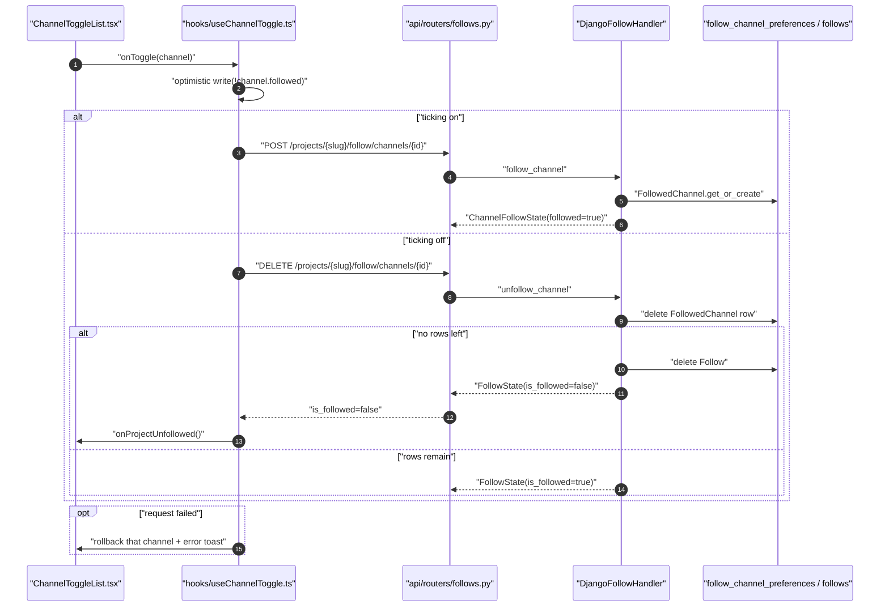
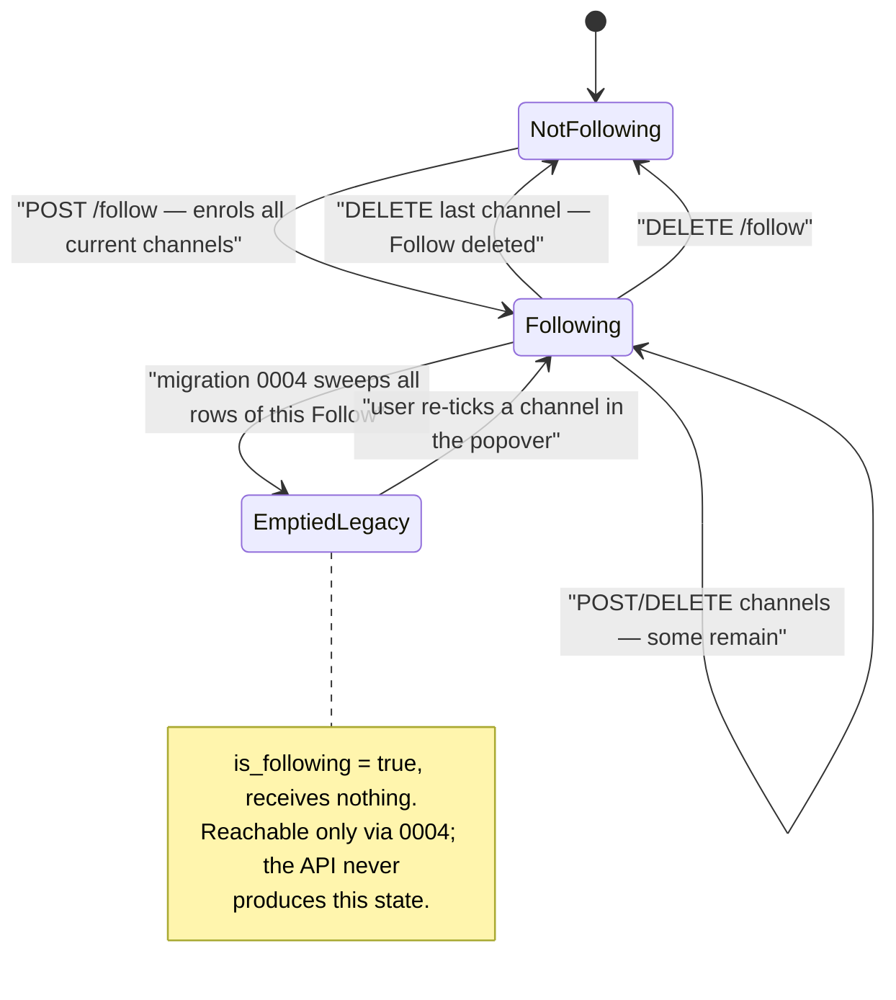
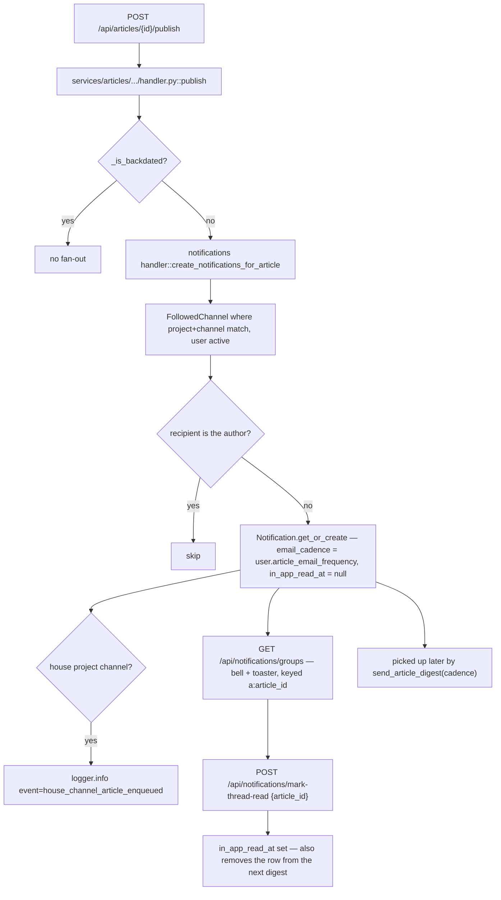
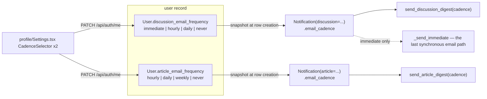
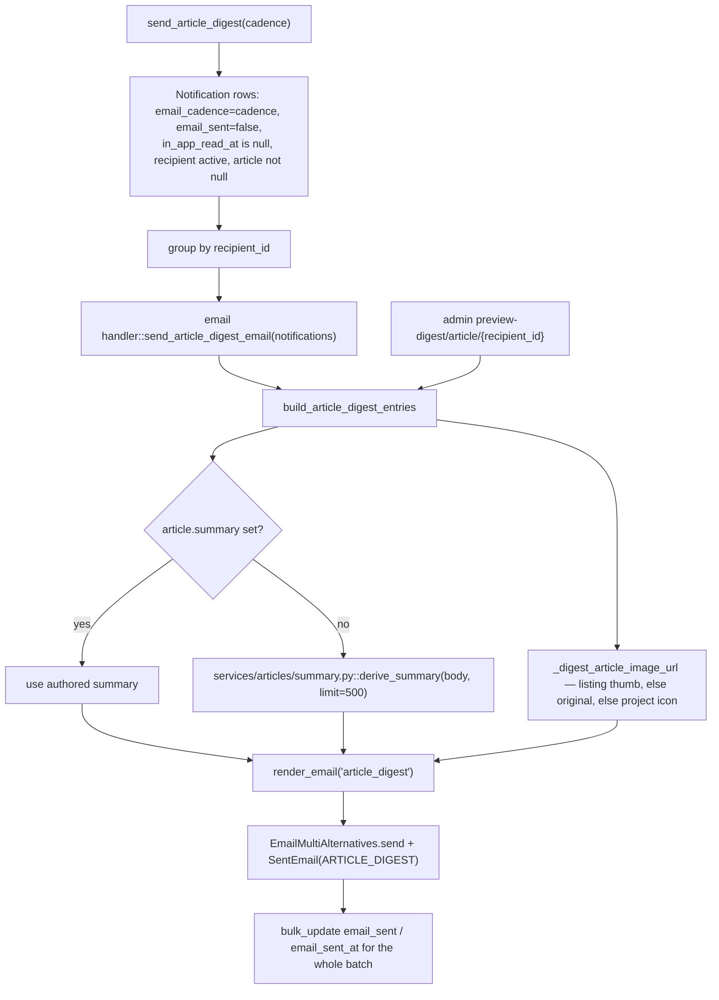
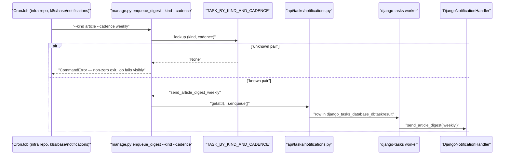
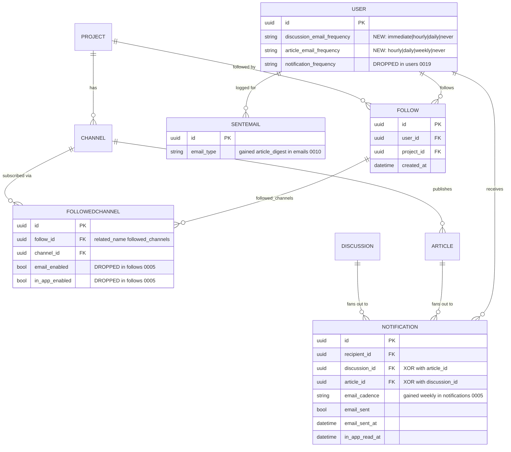
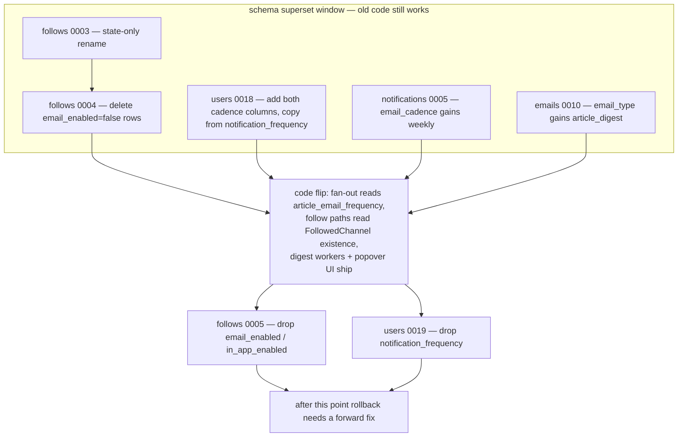
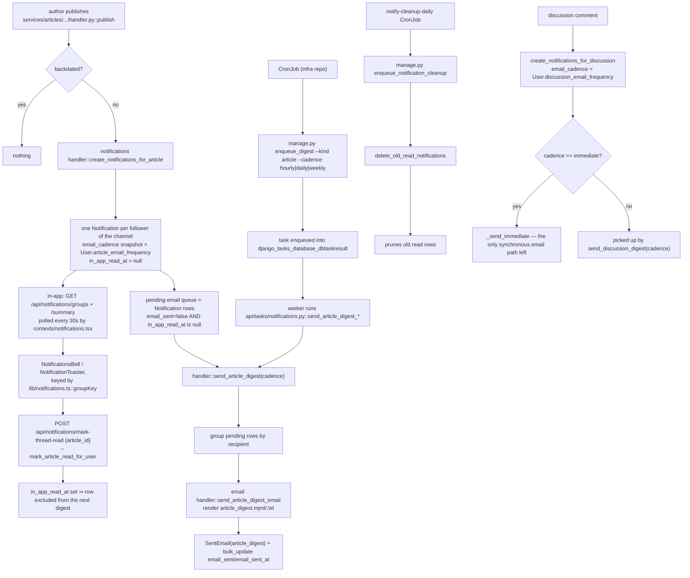

# Feature map: follows, notifications, email cadence

Scope: `git diff d2463b33...7a20fb38`, limited to follows, notifications, email cadence,
the digest, scheduling, and the profile/following UI.

## 1. What shipped

Five related changes, all downstream of one decision: **a channel subscription is a row,
not a pair of booleans.**

1. **Follows simplified.** `FollowChannelPreference` (with `email_enabled` /
   `in_app_enabled`) becomes `FollowedChannel` — existence of the row *is* the
   subscription. `PATCH .../channels/{id}` is replaced by `POST` / `DELETE`. Deleting the
   last followed channel deletes the project `Follow` too.
2. **Email cadence split per kind.** `User.notification_frequency` is replaced by
   `discussion_email_frequency` (immediate/hourly/daily/never) and
   `article_email_frequency` (hourly/daily/weekly/never). Articles have no immediate path.
3. **Article email becomes a digest.** The per-article `article_notification` email is
   replaced by a batched `article_digest` (MJML + text), with a markdown-stripped excerpt
   and a listing-image thumbnail, plus an admin preview for both digest kinds.
4. **Scheduling gets a seam.** Two management commands (`enqueue_digest`,
   `enqueue_notification_cleanup`) replace CronJobs that INSERTed straight into the
   django-tasks result table with a hard-coded `task_path` string.
5. **Frontend.** `useChannelToggle` + `ChannelToggleList` shared by the follow popover and
   the Following page; two cadence selectors in profile settings; in-app notification
   plumbing keyed by article *or* discussion instead of discussion only.

The intent, decisions and their alternatives are written up in
`openspec/changes/simplify-follow-and-cadence/design.md` — the code comments cite it by
decision number.

---

## 2. Per-channel follow: the row is the subscription

**What it does.** A user follows a project (`Follow`) and, under it, a set of channels
(`FollowedChannel`). There is no per-channel email/in-app switch any more: if you follow
the channel, its articles land in your bell and in your email digest at *your* cadence.

**End to end.**

- Model: `apps/follows/models.py:50` — `FollowedChannel`, FK `related_name="followed_channels"`,
  `unique_together = (("follow", "channel"))`, table still pinned to
  `follow_channel_preferences` (`apps/follows/models.py:62-67`, deliberately not renamed).
- Handler: `services/follows/django_impl/handler.py`
  - `follow` (`:17`) — `get_or_create` the `Follow`; **only if created** enrols every
    channel currently on the project.
  - `_resolve` (`:36`) — project → channel-on-project → follow, raising
    `ProjectNotFoundError` / `ChannelNotOnProjectError` / `NotFollowingError`.
  - `follow_channel` (`:53`) — idempotent `get_or_create`, returns `ChannelFollowState(followed=True)`.
  - `unfollow_channel` (`:64`) — deletes the row inside a transaction; if no
    `FollowedChannel` remains, deletes the `Follow` and returns `FollowState(is_followed=False)`.
- Query: `services/follows/django_impl/query.py`
  - `_follow_queryset` (`:20`) — three queries for the whole Following page:
    `select_related("project")` + prefetch of `followed_channels`, project channels ordered
    by `created_at`, and project gallery images narrowed by `project_gallery_images()`.
  - `_to_follow_with_preferences` (`:49`) — now enumerates **all project channels** and
    marks each `followed` by set membership, so unfollowed channels still render.
- API: `api/routers/follows.py`
  - `POST /api/projects/{slug}/follow/channels/{channel_id}` → `follow_channel` (`:109-118`), 200/404.
  - `DELETE /api/projects/{slug}/follow/channels/{channel_id}` → `unfollow_channel`
    (`:139-145`), returns `FollowStateResponse` rather than 204 precisely because the call
    may have unfollowed the project.
- Schemas: `api/schemas/follow.py` — `FollowChannelPreferenceResponse` →
  `ChannelFollowStateResponse{channel_id, channel_name, followed}`;
  `FollowChannelPreferencePatch` and `EmptyPatchError`
  (`services/follows/exceptions.py`) are gone.
- Frontend: `src/web-ui/src/lib/api/follows.ts` — `patchFollowChannel` →
  `followChannel` / `unfollowChannel`; `useChannelToggle`
  (`src/web-ui/src/hooks/useChannelToggle.ts:26`) does the optimistic write with
  *functional* state updates so two in-flight toggles can't clobber each other, rolls back
  only its own channel on failure (`:43`, `:53`), and calls `onProjectUnfollowed()` when the
  DELETE reports `is_followed: false`.
- `ChannelToggleList` (`src/web-ui/src/components/ChannelToggleList.tsx`) is a single
  checkbox list shared by `FollowPopover.tsx:110` and `app/profile/following/page.tsx:195`.

**Documented behavioural notes (not bugs):**

- **Channels added after you follow do not auto-enrol you.**
  `handler.py:17-32` only enrols on `created`. Design decision 7: a project owner must not
  be able to push into a follower's bell by adding a channel. The new channel renders
  unticked in the popover.
- Because `unfollow_channel` deletes the `Follow`, *re-following* a project is a fresh
  `Follow` and therefore enrols every current channel — covered by
  `services/follows/django_impl/test_handler.py:79`.
- A repeat `unfollow_channel` after the `Follow` is gone raises `NotFollowingError` → 404
  (`test_handler.py:179`), whereas it is idempotent while other channels remain (`:138`).

---

## 3. The emptied-Follow divergence

Worth its own section because two parts of the system deliberately disagree.

- **API:** last channel removed ⇒ `Follow` deleted (`handler.py:64-75`).
- **Migration `0004_sweep_both_off_rows`:** deletes `FollowedChannel` rows but leaves
  `Follow` rows untouched, including ones it empties
  (`apps/follows/migrations/0004_sweep_both_off_rows.py:9-45` docstring).

So an emptied `Follow` is a **legacy-only state**: it reports `is_following = true`, shows
on the Following page with "0 of N channels", and receives nothing. Nothing creates
another one and nothing cleans up the existing ones. The migration argues the case: mass
unfollowing from a data migration is a bigger action than a sweep should take, and 0002
seeds the house project with `email_enabled=True` unconditionally, so no house `Follow`
can be emptied by the sweep. Cross-referenced in
`openspec/changes/simplify-follow-and-cadence/design.md` decision 6.

---

## 4. Article fan-out and in-app notifications

**What it does.** Publishing an article creates one `Notification` row per follower of the
article's channel. The row carries both the in-app unread state and the email bookkeeping.
There is no synchronous article email any more.

**End to end.**

- Trigger: `services/articles/django_impl/handler.py:160-165` — `publish()` calls
  `HANDLERS.notifications.create_notifications_for_article(article.id)` only when
  `not _is_backdated(effective_published_at)` (`handler.py:46`). Editing `published_at`
  after publish never re-fires (`handler.py:129-133`).
- Fan-out: `services/notifications/django_impl/handler.py:181-246`
  - recipients = `FollowedChannel` rows on `(project, channel)` with
    `follow__user__is_active=True`; author excluded;
  - `Notification.get_or_create(recipient, article)` with
    `email_cadence = user.article_email_frequency` **snapshotted at creation** and
    `in_app_read_at = None` (everyone who follows the channel gets the bell entry, including
    users on `never` — see `test_article_fanout.py:68`);
  - `_send_article_immediate` and the `email_enabled` / `in_app_enabled` branching are
    deleted; the old "email on, in-app off ⇒ mark read at creation" trick is gone;
  - house-project channels emit one `event=house_channel_article_enqueued` log line per
    recipient including `recipient_frequency` (`handler.py:236-245`), which is the
    ranking-day silent-miss instrumentation from decision 9.
- Grouping for the bell: `_build_article_group` (`handler.py:102`) now sets
  `article_image_url` via `_article_listing_image_url` (`:93`, thumb variant → original),
  carried through `services/notifications/__init__.py` `NotificationGroup.article_image_url`
  and `api/schemas/notification.py:52,75`.
- Read: `POST /api/notifications/mark-thread-read` with `article_id`
  (`api/routers/notifications.py:66-71`; the endpoint and its exactly-one validator at
  `api/schemas/notification.py:83-96` pre-date this diff — what is new is the frontend
  wiring).
- Frontend:
  - `src/web-ui/src/lib/notifications.ts:33` — `groupKey()` returns `a:<article_id>` or
    `d:<root_discussion_id>`; `buildDeepLink` (`:3`) and `buildHeadline` (`:11`) grew article
    branches.
  - `src/web-ui/src/contexts/notifications.tsx` — the diff engine was discussion-only
    (`discussionGroupsOnly`, `newlyActiveRoots`); it is now key-based (`keyedGroups`,
    `newlyActiveKeys`, `groupsByKey`), so article groups can raise toasts. New
    `markArticleRead` (`:144`) calls `api.notifications.markArticleThread`
    (`lib/api/notifications.ts:47`).
  - `NotificationsBell.tsx:98` keys rows by `groupKey(group)` and optimistically marks the
    article read on click — the comment there records why: if the article was deleted
    between fan-out and click-through the render page 404s, so this is the only call that
    clears the stale row.
  - `NotificationToaster.tsx` debounces per key rather than per root and marks read on
    toast click.
  - `NotificationGroupItem.tsx:43-44` prefers `article_image_url` / `article_title` over the
    project icon and title.

Note the coupling the digest query creates: `send_article_digest` filters
`in_app_read_at__isnull=True` (`handler.py:313`), so reading a notification in-app before
the digest tick suppresses its email entirely. Same rule already applied to discussions.

---

## 5. Split email cadence

**What it does.** One global "notification frequency" becomes two independent per-kind
cadences with different option sets.

- `apps/users/models.py:12` `DiscussionEmailFrequency` — immediate, hourly, daily, never.
- `apps/users/models.py:19` `ArticleEmailFrequency` — hourly, daily, **weekly**, never.
  No `immediate`: article email is digest-only by design (decision 8).
- Fields at `apps/users/models.py:81` and `:86`, both defaulting to `hourly`.
- `apps/notifications/models.py:9-18` `NotificationCadence` is now the **union** of the two
  and gained `weekly`; the comment at `:10-13` records that a `Notification` row snapshots
  whichever per-kind user cadence applies, so `immediate` only ever appears on discussion
  rows and `weekly` only on article rows.
- API surface: `api/schemas/user.py` — `UserResponse` exposes both fields, `UserUpdate`
  accepts `discussion_email_frequency: DiscussionEmailFrequency` /
  `article_email_frequency: ArticleEmailFrequency`, so the enum narrowing is enforced at
  the boundary (a client cannot PATCH `article_email_frequency=immediate`).
- Admin: `apps/users/admin.py` lists and filters on both, and the "Email preferences"
  fieldset shows both.
- Frontend: `src/web-ui/src/app/profile/Settings.tsx` — the inline button group is
  extracted into a generic `CadenceSelector` (`:78`) rendered twice, with
  `DISCUSSION_OPTIONS` (`:7`) and `ARTICLE_OPTIONS` (`:14`); `updateCadence` (`:145`)
  optimistically sets, PATCHes, and rolls back on failure. `profile/page.tsx:192-193`
  passes both values down.

Consequence the design accepts explicitly: a user on hourly for both kinds with pending
content in both gets **two** emails on the same tick; unifying into one mixed-content
digest was dropped rather than deferred, and the old TODO comments about it are gone from
`handler.py`.

---

## 6. The article digest email

**What it does.** One email per recipient per tick, listing every unread, unsent article
notification at that cadence.

- Handler: `services/email/django_impl/handler.py:483` `send_article_digest_email(notifications)`
  — no-ops on an empty sequence, takes the recipient from `notifications[0].recipient`,
  renders `article_digest`, subject `"New articles - Naglasúpan"` (no longer per-project),
  and logs `SentEmailType.ARTICLE_DIGEST`. The `project=` argument is dropped from the
  `SentEmail` log rows because a digest spans projects.
- Entry building: `build_article_digest_entries` (`:113`) — per entry: project title/URL,
  channel name, article title, image URL, excerpt, article URL. Slug-or-id fallbacks for
  both project and article.
- **Markdown stripping in the excerpt.** `article.summary or derive_summary(article.body, limit=500)`
  with `ARTICLE_DIGEST_EXCERPT_MAX = 500` (`:99`). `services/articles/summary.py`
  (new in this branch) strips fenced code, headings, images before links, HTML tags, list
  and quote markers, and `*`/`` ` ``/`~` emphasis — leaving `_` alone on purpose so
  snake_case identifiers survive — then truncates on a word boundary with an ellipsis.
  The old code pasted raw markdown into a plain-text email and hard-cut at 500 chars.
  Tests: `services/email/django_impl/test_handler.py:447-483`.
- Image: `_digest_article_image_url` (`:102`) — listing image `thumb` variant, else the
  original, else `REPO.project.get_project_icon_url(article.project)`.
- Templates: `templates/email/article_digest.mjml` (56 lines, table-based rows with a 56px
  thumbnail, channel eyebrow, title link, project link, excerpt; footer links to profile
  settings as "change your article email frequency") and `article_digest.txt`.
- `templates/email/article_notification.mjml` / `.txt` are now **orphans** — nothing
  renders them. `SentEmailType.ARTICLE_NOTIFICATION` is kept and relabelled
  `"Article Notification (legacy)"` (`apps/emails/models.py:120`) so historical `SentEmail`
  rows still resolve.
- Interface: `services/email/handler_interface.py` — `send_article_notification_email(notification, article)`
  → `send_article_digest_email(notifications)`.
- Admin preview: `apps/notifications/admin.py`
  - the list view (`preview_digest_list_view`) now buckets unsent rows into
    `discussion_*` and `article_*` counts/projects and emits one preview URL per kind;
  - the detail route becomes `preview-digest/<str:kind>/<uuid:recipient_id>/` with
    `DIGEST_KINDS = ("discussion", "article")` and `Http404` on anything else;
  - the detail view branches template + context builder, and `?format=text` now renders the
    real text part (previously it rendered the discarded `_text`).
  - Tests: `apps/notifications/tests/test_admin_preview.py`.

---

## 7. Scheduling: the management-command seam

**What it does.** Gives the cron a stable CLI to call instead of a Python symbol, and makes
a bad schedule entry fail loudly.

**What it replaced.** Per the module docstring at
`apps/notifications/management/commands/enqueue_digest.py:1-12`, the CronJobs previously
`INSERT`ed directly into `django_tasks_database_dbtaskresult` with a hard-coded `task_path`
string. That INSERT succeeds whatever string it carries, so renaming a task in
`api/tasks/notifications.py` broke production silently — only the worker discovered the
path no longer resolved. Now an unknown `--kind` / `--cadence` is a non-zero exit on the
CronJob itself.

- `enqueue_digest.py:24` `TASK_BY_KIND_AND_CADENCE` maps `(kind, cadence)` → task name;
  `KINDS`/`CADENCES` (`:32-33`) are derived from it, so `argparse` `choices` and the map
  cannot drift. `(discussion, weekly)` is deliberately absent — `DiscussionEmailFrequency`
  has no weekly — and produces a `CommandError` naming the supported cadences (`:47-56`).
  `never` is not an enqueueable cadence at all.
- `enqueue_notification_cleanup.py` — same rationale, enqueues
  `delete_old_read_notifications`.
- Tasks renamed in `api/tasks/notifications.py`: `send_hourly_notifications` /
  `send_daily_notifications` → `send_discussion_digest_hourly|daily` (`:33`, `:40`) and
  `send_article_digest_hourly|daily|weekly` (`:47`, `:54`, `:61`). The handler method
  `send_batch_notifications(cadence)` is split into `send_discussion_digest` and
  `send_article_digest`; the old method's tail call into `_send_article_batch` is gone.
- The deployed wall-clock schedule is recorded as a comment at
  `api/tasks/notifications.py:18-30`: discussion+article hourly at :05, both dailies at
  18:00, article weekly Monday 18:00. **The CronJob manifests are not in this repo** — the
  comment points at `k8s/base/notifications/` in the infra repo. Nothing here can verify
  that the arguments match.
- Tests: `apps/notifications/management/commands/test_enqueue_digest.py` (each pair reaches
  its own task; discussion+weekly rejected; unknown kind/cadence rejected; `never` rejected)
  and `test_enqueue_notification_cleanup.py`.

---

## 8. Data model and migration path

Renamed model, unchanged table: `FollowedChannel.Meta.db_table` stays
`follow_channel_preferences` (`apps/follows/models.py:62-67`) — the comment says renaming
the table buys nothing and would invalidate raw-SQL references.

### Ordered migrations

**follows — the three-step rename → sweep → drop:**

1. `apps/follows/migrations/0003_rename_follow_channel_preference.py` — **state-only
   rename.** `RenameModel(FollowChannelPreference → FollowedChannel)` plus an `AlterField`
   updating the FK `related_name` to `followed_channels`. Because `db_table` is pinned, no
   SQL beyond that is emitted and no rows move.
2. `apps/follows/migrations/0004_sweep_both_off_rows.py` — **data sweep.**
   `RunPython(sweep_email_disabled)` deletes every `FollowedChannel` with
   `email_enabled=False`, in batches of 1000, logging `rows_kept` / `rows_deleted`. Reverse
   is an explicit documented no-op.
3. `apps/follows/migrations/0005_drop_legacy_booleans.py` — **column drop.** `RemoveField`
   for `email_enabled` and `in_app_enabled`. Its docstring states the third dependency:
   the code flip, i.e. every reader of those columns must already be gone.

**Old booleans → new channel preference, the mapping actually implemented:**

| legacy `email_enabled` | legacy `in_app_enabled` | after the sweep |
| --- | --- | --- |
| `True` | any | row kept ⇒ channel followed; delivery timing now comes from `User.article_email_frequency` |
| `False` | `False` | row deleted ⇒ channel not followed |
| `False` | `True` | row deleted ⇒ channel not followed — **this state is lost** |

The sweep keys on `email_enabled` alone, and the migration docstring
(`0004_sweep_both_off_rows.py:11-30`) explains why an `email_enabled OR in_app_enabled`
rule would have been wrong: `0002_seed_channels_and_house_follows` writes
`in_app_enabled=True` unconditionally on every row it seeds, so OR-ing against a constant
`True` would have matched every legacy row and deleted none — resubscribing everyone who
had unticked `email_opt_in_competition_results` / `email_opt_in_platform_updates`. The
in-app-only cohort is knowingly sacrificed; "erring toward a quiet inbox is the safer
direction". Users with no `Follow` on the house project stay unfollowed — the sweep never
adds rows.

**users:**

4. `apps/users/migrations/0018_user_article_email_frequency_and_more.py` — adds
   `article_email_frequency` (default `hourly`) and `discussion_email_frequency` (default
   `hourly`), then `RunPython(copy_notification_frequency_to_discussion)` copying
   `notification_frequency` into the discussion column via `F()`, then widens
   `notification_frequency`'s choices to the union (so the old column stays valid while
   both exist). Reverse resets the new column to `hourly` and leaves the original alone.
5. `apps/users/migrations/0019_drop_notification_frequency.py` — `RemoveField`. Docstring
   again names the code flip as a dependency.

**notifications / emails:**

6. `apps/notifications/migrations/0005_alter_notification_email_cadence.py` — adds `weekly`
   to `Notification.email_cadence` choices.
7. `apps/emails/migrations/0010_alter_sentemail_email_type.py` — adds `article_digest` and
   relabels `article_notification` as legacy.

---

## 9. Scheduling and fan-out, end to end

**Documented divergences and knowingly-accepted states, collected:**

- Emptied `Follow` rows from migration 0004 (section 3).
- In-app-only subscribers lost by the sweep (section 8).
- Channels added after a follow do not enrol existing followers (section 2).
- Users on `never` still accumulate in-app `Notification` rows; the design doc lists
  cleanup of those as an open question.
- Users on `weekly` will not see a house-channel/ranking article by email until Monday;
  the `event=house_channel_article_enqueued` log line exists specifically to quantify that
  cohort, `never` included.
- Two separate digest emails on the same tick when a recipient has both discussion and
  article content pending.
- `article_notification.mjml` / `.txt` remain in `templates/email/` with no renderer, and
  `SentEmailType.ARTICLE_NOTIFICATION` survives as `(legacy)` for historical rows.
